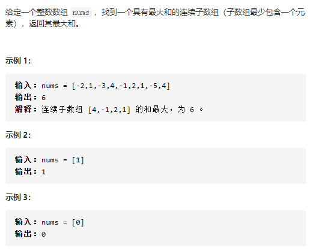
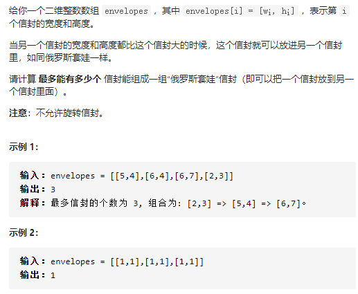
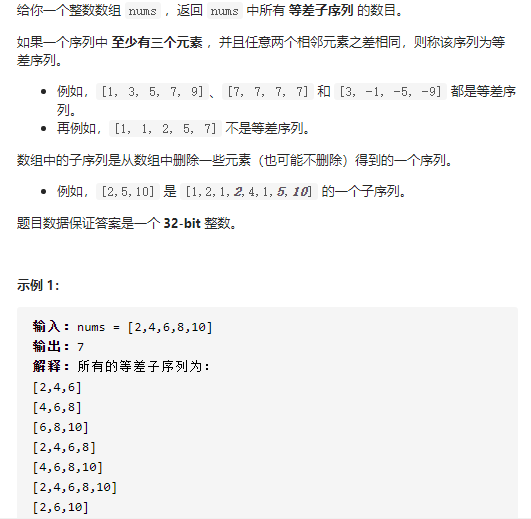

## 子串

### 回文子串

- **dp\[i][j]**：表示区间范围[i,j] （注意是左闭右闭）的子串是否是回文子串，如果是dp\[i][j]为true，否则为false。

- **核心思想**：当s[i]与s[j]不相等，那没啥好说的了，dp\[i][j]一定是false。

  当s[i]与s[j]相等时，这就复杂一些了，有如下三种情况

  情况一：下标i 与 j相同，同一个字符例如a，当然是回文子串
  情况二：下标i 与 j相差为1，例如aa，也是回文子串
  情况三：下标：i 与 j相差大于1的时候，例如cabac，此时s[i]与s[j]已经相同了，我们看i到j区间是不是回文子串就看aba是不是回文就可以了，那么aba的区间就是 i+1 与 j-1区间，这个区间是不是回文就看dp\[i + 1][j - 1]是否为true。

**核心代码**

  ```java
  if (s[i] == s[j]) {
      if (j - i <= 1) { // 情况一 和 情况二
          result++;
          dp[i][j] = true;
      } else if (dp[i + 1][j - 1]) { // 情况三
          result++;
          dp[i][j] = true;
      }
  }
  ```

### 最长回文子串

思路和回文子串相同，再判断回文子串的地方加上start,end用来更新最终指向字符串的下标。


- **dp\[i][j]**: 表示区间范围[i,j] （注意是左闭右闭）的子串是否是回文子串，如果是dp\[i][j]为true，否则为false。

- int result = 0;int start = 0;int end = 0;//result表示的为回文子串的长度；start,end分别表示回文子串的开始与结束。

**核心代码**:

  ```
  if (s.charAt(i) == s.charAt(j) && (j - i <= 1 || dp[i + 1][j - 1])) {
      if(result < j-i+1){
          start = i;
          end = j;
          result = j-i+1;
      }
          dp[i][j] = true;
  }
      
  ```
## 子数组

### 最长递增子数组

- **dp[i]**: ...以nums[i]结尾的最长递增子数组的长度

**核心代码**

  ```java
  for(int i=1;i<nums.length;i++){
              dp[i] = 1;
              if(nums[i]>nums[i-1]){
                  dp[i] = dp[i-1]+1;    
              }
              result = Math.max(result,dp[i]);
          }
  ```

  [类似题目](#最长递增子序列)

### 最大子序和



- **dp[i]:** 以nums[i]结尾的连续子数组的最大和
- **核心思想**：dp[i] = Math.max(dp[i-1]+nums[i],nums[i]);

**完整代码**

```java
class Solution {
    public int maxSubArray(int[] nums) {
        //dp[i]:表示以nums[i]结尾的连续子数组的最大和 
        int[] dp = new int[nums.length];
        int result = nums[0];
        dp[0]=nums[0];
        for(int i=1;i<nums.length;i++){
            dp[i] = Math.max(dp[i-1]+nums[i],nums[i]);
            result = Math.max(result,dp[i]);
        }
        return result;
        
    }
}
```


### 等差数列划分


- **注意**： 题目要求的是子数组的个数，与子串有些类似，但这里不能用求子串的方法。因为求子串核心思想里可以判断s.charAt(i)与s.charAt(j)是否相等来判断是否回文，而由于nums[i]与nums[j]之间有没有其他的数或者有多少数我们是无从判断的，所以本题无法套求子串的思路来判断是否是等差数列。

- **dp\[i][j]**: 以数组第i个元素结尾的等差数列的个数为dp[i]

- int diff = nums[1]-nums[0];int num=0; //diff表示差值，num表示总的等差数列的个数

- **核心思想**: 当nums[i]-nums[i-1]==diff时，那没啥好说的了，肯定是等差数列，则dp[i] = dp[i-1]+1 ，num+=dp[i]; 

  如果!=diff,更新一下diff,即diff = nums[i]-nums[i-1];

**完整代码**

  ```java
      //直接动规
      // public int numberOfArithmeticSlices(int[] nums) {
  
      //     //dp[i]表示以nums[i]为等差数列结尾的等差数列个数
      //     int n = nums.length;
      //     int dp[] = new int[n];
      //     if(nums.length<3){
      //         return 0;
      //     }
      //     int diff = nums[1]-nums[0];
      //     int num=0;
      //     for(int i=2;i<n;i++){
      //         if(nums[i]-nums[i-1]==diff){
      //             dp[i] = dp[i-1]+1;
      //             num+=dp[i];
      //         }else{
      //             diff = nums[i]-nums[i-1];
      //         }
      //     }
      //     return num;
      // }
  //状态压缩
      // public int numberOfArithmeticSlices(int[] nums) {
  
      //     //dp[i]表示以nums[i]为等差数列结尾的等差数列个数
      //     int n = nums.length;
      //     int pre = 0;
      //     if(nums.length<3){
      //         return 0;
      //     }
      //     int diff = nums[1]-nums[0];
      //     int num=0;
      //     for(int i=2;i<n;i++){
      //         if(nums[i]-nums[i-1]==diff){
      //             pre = pre+1; 
      //             num+=pre;
      //         }else{
      //             diff = nums[i]-nums[i-1];
      //             pre=0;
      //         }
      //     }
      //     return num;
      // }
  ```

### 等差数列划分 II -  子序列

详见[子序列部分](#等差数列划分 II - 子序列)


## 子序列
### 最长回文子序列

- **dp\[i][j]**: 表示字符串s从i到j最长回文子序列长度

- **核心思想**: 当s[i]与s[j]相等，那没啥好说的了，dp\[i][j]一定是等于dp\[i+1][j-1]+2。

  当s[i]与s[j]不相等,dp\[i][j]应该等于dp\[i+1][j], dp\[i+1][j-1], dp\[i][j-1]的最大值。

**核心代码**: 

   ```java
    if(s.charAt(i)==s.charAt(j)){
        dp[i][j] = dp[i+1][j-1]+2;
    }
    else{
        dp[i][j] = Math.max(dp[i][j-1],Math.max(dp[i+1][j],dp[i+1][j-1]));
    }
   ```

### 最长公共子序列


- **dp\[i][j]**: 字符串text1从0-i,与字符串text2从0到j的最长公共子序列的长度

- **核心思想**： 如果text1的第i个元素等于text2的第j个元素，那么不用说了，dp\[i][j] = dp\[i-1][j-1];

  如果不相等，我们需要知道得到text1的第i个元素使得子序列长度最大还是得到text2的第j个元素使得子序列长度最大，所以我们获得两者最大值即可，(dp\[i-1][j-1]写不写都不影响)即dp\[i][j]=Math.max(dp\[i-1][j], Math.max(dp\[i-1][j-1],dp\[i][j-1]));

- **初始化**：正常初始化即可，请看下面完整代码

**完整代码**

  ```java
  class Solution {
      public int longestCommonSubsequence(String text1, String text2) {
  		//dp[i][j] 字符串text1从0-i,和字符串text2从0-j的公共子序列的长度
  		int dp[][] = new int[text1.length()][text2.length()];
          for(int i=0;i<text2.length();i++){
              if(text2.charAt(i)==text1.charAt(0)){
                  for(int j=i;j<text2.length();j++){
                      dp[0][j] = 1;
                  }
                  break;
              }
          }
          for(int i=0;i<text1.length();i++){
              if(text1.charAt(i)==text2.charAt(0)){
                  for(int j=i;j<text1.length();j++){
                      dp[j][0] = 1;
                  }
                  break;
              }
          }
  		for(int i=1;i<text1.length();i++) {
  			for(int j=1;j<text2.length();j++) {
  				if(text1.charAt(i)==text2.charAt(j)) {
  					dp[i][j]=dp[i-1][j-1]+1;
  				}
  				else {
  					dp[i][j]=Math.max(dp[i-1][j], Math.max(dp[i-1][j-1],dp[i][j-1]));
  				}
  			}
  			
  		}
  		return dp[text1.length()-1][text2.length()-1];
      }
  }
  ```

### 最长递增子序列


- **注意**: 这是子序列的类型。

- **dp\[i]**:  以nums[i]的结尾的最长递增子序列的最大长度，如[1,5,2,3,4] ,dp[4]得到的最长递增子序列为2,3,4，即dp[4]=3

- **核心思想**: dp数组全部初始化为1，如果dp[j]<dp[i],更新dp[i],即dp[i] = Math.max(dp[i],dp[j]+1)；

- **提醒**： 我们遍历的目的是找到从j...到i的最长序列，如下代码第一个for循环是为了固定i,第二个for循环是为了固定j

**核心代码**

```java

for(int i=0;i<nums.length;i++){
            dp[i] = 1;
            for(int j=0;j<i;j++){
                if(nums[i]>nums[j]){
                    dp[i] = Math.max(dp[i],dp[j]+1);
                }
            }
            result = Math.max(result,dp[i]);
        }

```


**完整代码**

```java
class Solution {
    public int lengthOfLIS(int[] nums) {
        //dp[i]: ...到i的递增子序列（必须包含i）的最大长度，如[1,5,2,3,4] ,dp[4]得到的最长递增子序列为2,3,4
        int result = 0;
        int[] dp = new int[nums.length];
        for(int i=0;i<nums.length;i++){
            dp[i] = 1;
            for(int j=0;j<i;j++){
                if(nums[i]>nums[j]){
                    dp[i] = Math.max(dp[i],dp[j]+1);
                }
            }
            result = Math.max(result,dp[i]);
        }
        return result;
    }
}
```
### 俄罗斯套娃信封问题



- **dp[i]**: 以envelopes[i]结尾的最长递增子序列的长度

- **核心思想**: 与[最长递增子序列](#最长递增子序列)一样

- **核心代码**：在进行循环前需要先对envelopes进行排序处理，可以按照第一个元素从小到大，第一个元素相等则按照第二个元素从大到小排序，这里必须从大到小，因为如果两封信相等，那么必须有一封装不了而舍弃，从大到小排dp[i]就不会大于dp[j],从而舍弃dp[i]，也就是说dp[i]

  举个🌰，输入[[4,5],[4,6],[6,7],[2,3],[1,1]]，

  按照正确排序结果为[[1, 1], [2, 3], [4, 6], [4, 5], [6, 7]]，

  按照错误排序结果为[[1, 1], [2, 3], [4, 5], [4, 6], [6, 7]]，使用这种会多一中1,3,5,6,7这种结果显然是不对的

```java
Arrays.sort(envelopes,new Comparator<int[]>(){
            @Override
            public int compare(int[] o1,int[] o2){
                return o1[0]==o2[0]?o2[1]-o1[1]:o1[0]-o2[0];
            }
        });
        for(int i=0;i<n;i++){
            dp[i] = 1;
            for(int j=0;j<i;j++){
                if(envelopes[i][1]>envelopes[j][1]){
                    dp[i] = Math.max(dp[i],dp[j]+1);
                }
            }
            result = Math.max(result,dp[i]);
        }
```


- **完整代码**

```java
class Solution {
    public int maxEnvelopes(int[][] envelopes) {
        //dp[i]:以nums[i]结尾的 组成一组“俄罗斯套娃”信封的最大信封数
        int n = envelopes.length;
        int[] dp = new int[n];
        int result = 0;
        Arrays.sort(envelopes,new Comparator<int[]>(){
            @Override
            public int compare(int[] o1,int[] o2){
                return o1[0]==o2[0]?o2[1]-o1[1]:o1[0]-o2[0];
            }
        });
        for(int i=0;i<n;i++){
            dp[i] = 1;
            for(int j=0;j<i;j++){
                if(envelopes[i][1]>envelopes[j][1]){
                    dp[i] = Math.max(dp[i],dp[j]+1);
                }
            }
            result = Math.max(result,dp[i]);
        }
        return result;
    }
}
```


### 最长递增子序列的个数


- **dp[i]**: 以nums[i]结尾的最长递增子序列长度
  **count[i]**：以nums[i]结尾的最长递增子序列个数

  **初始化**：均为1

- **核心思想**：比[最长递增子序列](#最长递增子序列)多了一个count数组，在处理dp数组时也把count数组处理一下

- **核心代码**： 判断条件如果不考虑count数组的话，实际上就是dp[i]=Math.max(dp[i],dp[j]+1)的分开版；

  如果dp[j]+1>dp[i],dp[i]的最长递增子序列就增加了，dp[i]=dp[j]+1;把count[j]赋值给count[i]，是因为把nums[i]添加到nums[j]的子序列后，最长子序列的数量没有变化。*相当于把原来的count[i]丢弃了，因为最长递增子序列增加需要更新count*

  如果dp[j]+1==dp[i],说明最长递增子序列长度相同，把nums[i]添加到nums[j]的子序列后，以nums[i]结尾的子序列的数量增加了count[j].*这个时候不用把count[i]丢弃，因为最长递增子序列并未增加，在原来的基础上加上count[j]即可。*

 ```java
  if(nums[i] > nums[j]){
      if(dp[j] + 1 > dp[i]){
          dp[i] = dp[j] + 1;
          count[i] = count[j];
      }else if(dp[j] + 1 == dp[i]){
          count[i] += count[j];
      }
  }
 ```

**完整代码**

```java
class Solution {
    public int findNumberOfLIS(int[] nums) {
        int result = 0;
        //**dp[i]**: 以nums[i]结尾的最长递增子序列长度
//**count[i]**：以nums[i]结尾的最长递增子序列个数
        int[] count = new int[nums.length];
        int[] dp = new int[nums.length];
        for(int i=0;i<nums.length;i++){
            dp[i] = 1;
            count[i]=1;
            for(int j=0;j<i;j++){
                if(nums[i]>nums[j]){
                    if(dp[j]+1>dp[i]){
                        dp[i]=dp[j]+1;
                        count[i]=count[j];
                    }
                    else if(dp[j]+1==dp[i]){
                        count[i]+=count[j];
                    }
                }                     
            }
            result = Math.max(result,dp[i]);
        }
        int res = 0;
        for(int i=0;i<nums.length;i++){
            if(dp[i]==result){
                res+=count[i];
           }
       }
        return res;
    }
}
```


### 等差数列划分 II - 子序列




- **注意**：这是一个子序列类型的题目,而[等差数列划分](#等差数列划分)是子数组也可以说是子串(字符串类型的，与子数组本质一样)类型的。

- Mapdp.get(j) {key:差值，value:以nums[j]为结尾，差值为d的弱等差子序列的个数},这里使用HashMap是由于代码实现时，由于nums[i] 的范围很大，所以计算出的公差的范围也很大，我们可以将状态转移二维数组用哈希表代替。

**完整代码**

  ```java
 public int numberOfArithmeticSlices(int[] nums) {
          // 弱等差子序列的长度至少为2
          int ans = 0, n = nums.length;
          HashMap<Long, Integer>[] dp = new HashMap[n];
          for(int i = 0; i < n; i++) {
              dp[i] = new HashMap<>();
          }
          for(int i = 0; i < n; i++) {
              for(int j = 0; j < i; j++) {
                  // 首先计算nums[i] 和 nums[j] 之间的差值
                  long d = 1L * nums[i] - nums[j];
                  // 获得以nums[j]为结尾，差值为d的弱等差子序列的个数
                  int cnt = dp[j].getOrDefault(d, 0);
                  // 所有以nums[j]为结尾，差值为d的弱等差子序列加上nums[i]后长度至少为3，一定是符合题意的一个等差子序列
                  ans += cnt;
                  // 以nums[i]结尾，差值为d的弱等差子序列的个数应该加上两部分
                  //      一部分以nums[j]为结尾，差值为d的弱等差子序列的个数
                  //      另一部分是nums[j], nums[i]这两个元素构成的弱等差子序列
                  dp[i].put(d, dp[i].getOrDefault(d, 0) + cnt + 1);
              }
          }
          return ans;
      }
  
  ```

  


## 待写

368. 最大整除子集	
740. 删除并获得点数	
978. 最长湍流子数组	
1035. 不相交的线	
1713. 得到子序列的最

```
'单串问题：最经典单串 LIS 系列': ['最长上升子序列', '最长递增子序列的个数', '俄罗斯套娃信封问题'],
 '单串问题：最大子数组和系列': ['最大子序和',
  '乘积最大子组数',
  '环形子数组的最大和',
  '最大子矩阵',
  '矩形区域不超过 K 的最大数值和'],
 '单串问题：打家劫舍系列': ['打家劫舍', '打家劫舍 II', '删除与获得点数', '3n 块披萨'],
 '单串问题：变形，需要两个位置的情况: dp[i][j] 以 j, i 结尾': ['最长的斐波那契子序列的长度', '最长等差数列'],
 '单串问题：与其它算法配合': ['最大整除子集'],
 '单串问题：其它单串 dp[i] 问题': ['最长有效括号',
  '等差数列划分',
  '解码方法',
  '分割回文串 II',
  '比特位计数',
  '使序列递增的最小交换次数',
  '最低加油次数',
  '两个字符串的删除操作'],
 '单串问题：带维度单串 dp[i][k]，i 为位置，k 为附加的维度': ['最大平均值和的分组',
  '鸡蛋掉落',
  '粉刷房子',
  '粉刷房子 II',
  '奇偶跳',
  '青蛙过河',
  '安排邮筒',
  '抛掷硬币',
  '分割数组的最大值',
  '给房子涂色 III'],
 '单串问题：股票系列: dp[i][k][state] i 是时间，k 是次数，state 是状态': ['买卖股票的最佳时机',
  '买卖股票的最佳时机 II',
  '买卖股票的最佳时机 III',
  '买卖股票的最佳时机 IV',
  '最佳买卖股票时机含冷冻期',
  '买卖股票的最佳时机含手续费'],
 '双串': [],
 '双串问题：最经典双串 LCS 系列': ['最长公共子序列', '两个字符串的最小 ASCII 删除和', '最长重复子数组'],
 '双串问题：字符串匹配系列': ['编辑距离', '通配符匹配', '正则表达式匹配'],
 '双串问题：其它双串 dp[i][j] 问题': ['交错字符串', '不同的子序列'],
 '双串问题：带维度双串 dp[i][j][k]': ['扰乱字符串'],
 '矩阵': [],
 '矩阵问题：矩阵 dp[i][j]': ['三角形最小路径和', '最小路径和', '地下城游戏', '最大正方形', '下降路径最小和'],
 '矩阵问题：矩阵 dp[i][j][k]': ['最大矩形', '矩形区域不超过 K 的最大数值和', '最大子矩阵', '切披萨的方案数'],
 '带维度单串 dp[i][k]': [],
 '无串线性问题': ['只有两个键的键盘', '丑数 II', '完全平方数', '整数拆分'],
 '总结': [],
 '前缀和简介': [],
 '求区间和': [],
 '实现前缀和问题': ['区域和检索 - 数组不可变', '二维区域和检索 - 矩阵不可变'],
 '数据结构维护前缀和问题：HashMap 维护（1）': [],
 '数据结构维护前缀和': ['和等于 k 的最长子数组长度', '连续数组', '每个元音包含偶数次的最长子字符串'],
 '数据结构维护前缀和问题：HashMap 维护（2）': ['和为 K 的子数组', '统计优美子数组'],
 '数据结构维护前缀和问题：HashMap 维护（3）': ['连续的子数组和', '和可被 K 整除的子数组'],
 '数据结构维护前缀和问题：前缀和（积）与后缀和（积）均需要': ['除自身以外数组的乘积',
  '寻找数组的中心索引',
  '找两个和为目标值且不重叠的子数组'],
 '数据结构维护前缀和问题：二维前缀和': ['元素和为目标值的子矩阵数量', '矩阵区域和', '最大子矩阵', '矩形区域不超过 K 的最大数值和'],
 '运算推广': [],
 '运算推广问题：前缀积': ['乘积最大子数组', '乘积小于 K 的子数组', '最后 K 个数的乘积'],
 '运算推广问题：前缀异或': ['子数组异或查询', '形成两个异或相等数组的三元组数目'],
 '差分': [],
 '差分问题': ['区间加法'],
 '区间动态规划简介': [],
 '区间动态规划经典问题': [],
 '回文相关问题': ['最长回文子串',
  '回文子串',
  '最长回文子序列',
  '段式回文',
  '统计不同回文子字符串',
  '让字符串成为回文串的最少插入次数']}
```

### 数据结构
B树，B+树，线段树，跳表
